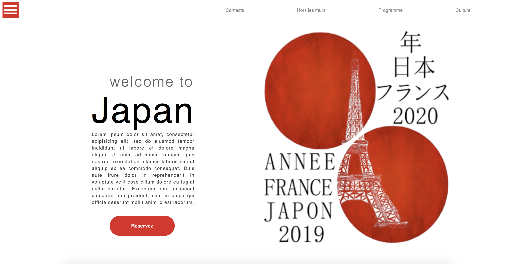

## Contenu

Vous trouverez ici plusieurs templates que j'ai pu reproduire pour apprendre et/ou enrichir mes connaissances autour du langage HTML et CSS.

# Template 1 :
- Page d'accueil d'une boutique de plante
- Reproduction d'une image trouvée sur Dribble

# Template 2 :
- Formulaire de contact
- Reproduction d'une image trouvée sur Dribble
- Premier formulaire réalisé (acquisition de nouvelles connaissances)

# Template 3 :
- Page d'accueil d'un site web
- Réalisation de la maquette de départ sur AdobeXd

